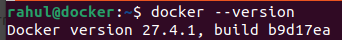

### This document provides an overview of basic Docker commands with examples to help you get started.

## Prerequisites
- Install Docker from [Docker's official website](https://www.docker.com/).
- Ensure Docker is running by executing:

### 1. Check Docker Version

```bash
docker --version
```
## Example Output:




### 2. Pull an Image Download an image from Docker Hub.

```bash
docker pull <image_name>
```
## Example


### 3. List Images Display all downloaded images.

```bash
docker images
```
## Example:


### 4. Run a Container Run a container from an image.

```bash
docker run <image_name>
```
## Example:


